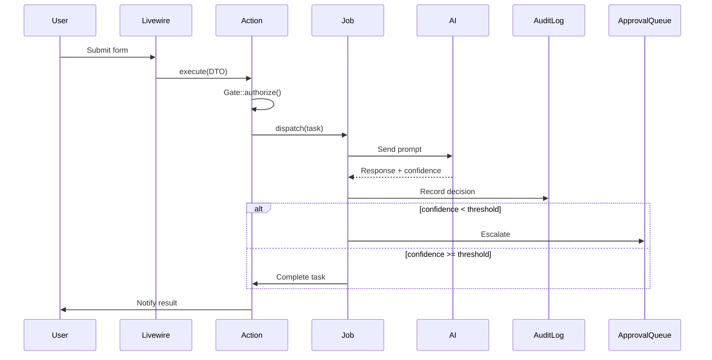
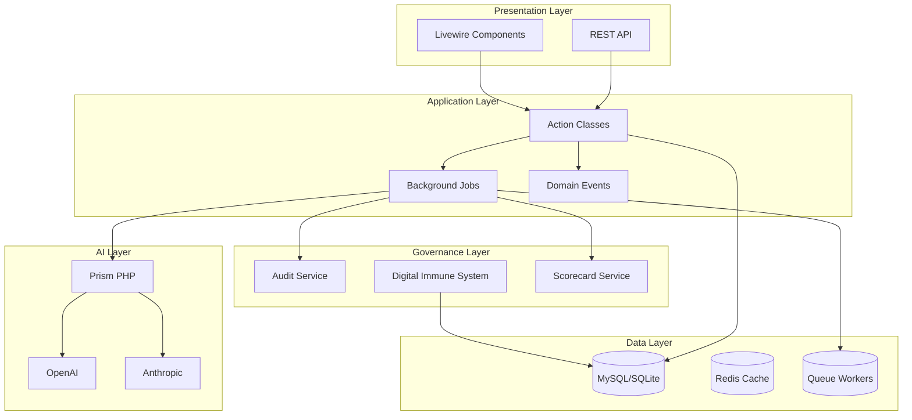
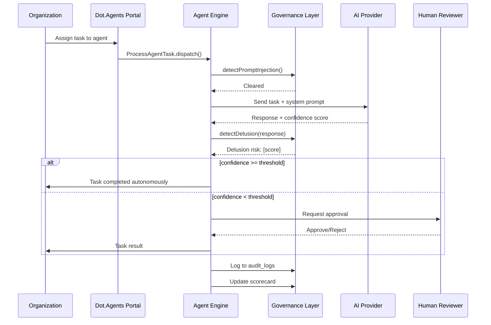

# Documentation Generator

Generates structured, enterprise-grade documentation for the Dot.Agents platform. Covers APIs, agents, workflows, database schemas, and architecture diagrams — all derived from the actual codebase so documentation stays in sync.

## When to Activate

- New feature added with no accompanying documentation
- API endpoint needs OpenAPI/Swagger spec
- Agent configuration needs explanation
- Database schema changes need documentation
- Architecture diagrams need updating
- User asks for "docs", "README", "diagram", or "specification"

---

## 1. API Documentation

### Format: OpenAPI 3.1 (preferred) or Markdown

#### OpenAPI Template
```yaml
openapi: 3.1.0
info:
  title: Dot.Agents Platform API
  version: 1.0.0
  description: |
    Enterprise AI Workforce Platform API.
    All endpoints require Bearer token authentication (Laravel Sanctum).
    All responses are scoped to the authenticated user's current organization.

servers:
  - url: https://app.dotagents.com/api
    description: Production

security:
  - bearerAuth: []

components:
  securitySchemes:
    bearerAuth:
      type: http
      scheme: bearer
      bearerFormat: JWT

paths:
  /agents/deployments:
    get:
      summary: List agent deployments
      description: Returns all active agent deployments for the current organization.
      tags: [Agents]
      parameters:
        - name: status
          in: query
          schema:
            type: string
            enum: [active, paused, failed]
        - name: page
          in: query
          schema:
            type: integer
      responses:
        '200':
          description: Paginated list of deployments
          content:
            application/json:
              schema:
                $ref: '#/components/schemas/AgentDeploymentPage'
        '401':
          $ref: '#/components/responses/Unauthorized'
        '403':
          $ref: '#/components/responses/Forbidden'
```

### Markdown API Endpoint Template
```markdown
## [METHOD] /api/[resource]

**Description:** [What this endpoint does]

**Authentication:** Bearer token (Sanctum)
**Authorization:** `[policy-name]` Policy — `[ability]` ability

### Request

**Headers:**
| Header | Value |
|--------|-------|
| Authorization | Bearer {token} |
| Content-Type | application/json |
| X-Organization-ID | {organization_id} |

**Body:**
| Field | Type | Required | Description |
|-------|------|----------|-------------|
| field | string | Yes | Description |

### Response: 200 OK
```json
{
  "data": {
    "id": 1,
    "field": "value"
  },
  "message": "Success"
}
```

### Error Responses
| Code | Meaning |
|------|---------|
| 401 | Unauthenticated |
| 403 | Unauthorized (Policy rejection) |
| 422 | Validation failed |
| 500 | Server error |
```

---

## 2. Agent Documentation

### Template: Agent Specification Document
```markdown
# [Agent Name] Agent

**Version:** [X.Y]
**Type:** [advisory | semi-autonomous | autonomous | executive_approval]
**Model:** [gpt-4o | claude-3-5-sonnet | etc.]
**Status:** [production | beta | deprecated]

## Purpose
[What business problem this agent solves in 2–3 sentences]

## Capabilities
- [Capability 1]
- [Capability 2]
- [Capability 3]

## Deployment Configuration
| Setting | Default | Description |
|---------|---------|-------------|
| confidence_threshold | 75 | Minimum confidence before auto-execution |
| deployment_mode | advisory | Autonomy level |
| max_context_tokens | 4096 | Maximum context window per execution |
| custom_instructions | null | Organization-specific instructions |

## Input Format
```json
{
  "task_type": "string",
  "payload": {},
  "context": {
    "organization_id": "int",
    "user_id": "int"
  }
}
```

## Output Format
```json
{
  "result": {},
  "confidence_score": 0.0,
  "delusion_risk_score": 0.0,
  "reasoning": "string",
  "requires_approval": false
}
```

## Governance
- Audit logged: ✅ Yes
- Approval workflow: ✅ Enabled (when confidence < threshold)
- Delusion detection: ✅ Enabled
- Scorecard dimensions tracked: [list]

## Limitations
- [Limitation 1]
- [Limitation 2]

## Example Usage
[Code or UI walkthrough example]

## Pricing
- Approximate tokens per execution: [range]
- Estimated cost per 1,000 executions: $[amount]
```

---

## 3. Workflow Documentation

### Template: Workflow Specification
```markdown
# [Workflow Name] Workflow

## Overview
[Description of what this workflow accomplishes]

## Trigger
[What initiates this workflow: user action, schedule, event, API call]

## Flow Diagram


## Steps
1. **[Step Name]:** [Description] → [Class/File responsible]
2. **[Step Name]:** [Description] → [Class/File responsible]

## Events Fired
| Event | When | Listeners |
|-------|------|-----------|
| [EventName] | [Trigger] | [ListenerName] |

## Error Handling
| Error | Cause | Recovery |
|-------|-------|----------|
| [Error] | [Cause] | [How it's handled] |
```

---

## 4. Database Documentation

### Generate Schema Documentation from Migration Files
For each table, document:

```markdown
## Table: `[table_name]`

**Purpose:** [What this table stores]
**Domain:** [Agents | Governance | Organizations | Billing]
**Tenant-scoped:** ✅ Yes / ❌ No

### Columns
| Column | Type | Nullable | Default | Description |
|--------|------|----------|---------|-------------|
| id | bigint unsigned | No | auto | Primary key |
| organization_id | bigint unsigned | No | — | Tenant isolation FK |
| [column] | [type] | [Yes/No] | [default] | [description] |
| created_at | timestamp | Yes | null | |
| updated_at | timestamp | Yes | null | |

### Indexes
| Index | Columns | Type | Purpose |
|-------|---------|------|---------|
| PRIMARY | id | Primary | — |
| idx_org_status | organization_id, status | Composite | Tenant-scoped status queries |

### Relationships
| Relationship | Type | Related Table | FK |
|-------------|------|--------------|-----|
| organization | belongsTo | organizations | organization_id |
| [relation] | [type] | [table] | [fk] |

### Business Rules
- [Rule 1]
- [Rule 2]
```

### Auto-Generate from Schema
```bash
# Use Laravel Boost MCP to inspect schema
# mcp_laravel_boost_database-schema → document all tables
```

---

## 5. Architecture Diagrams

### System Overview Diagram Template


### Agent Interaction Diagram Template


---

## 6. Documentation Output Standards

- All documentation files go in `resources/markdown/` for platform docs
- Agent specs go in `resources/markdown/agents/[agent-slug].md`
- API docs go in `resources/markdown/api/[resource].md`
- Architecture docs go in `resources/markdown/architecture/`
- All diagrams use Mermaid (`.mermaid` blocks or `.md` with mermaid fences)
- Keep documentation co-located with code when possible (PHPDoc for classes)
- Never document things that are obvious from the code alone — document *why*, not *what*
