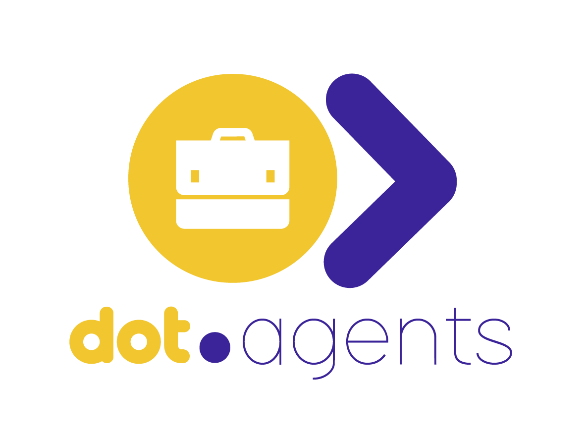

<div align="center">



### Enterprise AI Workforce Platform

**Hire, deploy, manage, monitor, and govern specialized AI Agents as digital workforce members.**

[](https://php.net)
[](https://laravel.com)
[](https://livewire.laravel.com)
[](https://tailwindcss.com)
[](tests/)
[](phpunit.xml)
[](LICENSE)

</div>

---

## What is Dot.Agents?

Dot.Agents is a **production-grade, multi-tenant enterprise platform** that enables organizations to hire, configure, deploy, and govern AI Agents as first-class digital workforce members. Agents operate across four autonomy modes — from advisory to fully autonomous — with every decision logged, scored, and governable.

This is not a chatbot wrapper. It is a full **AI Workforce Operating System** with agent memory, skill execution pipelines, multi-agent orchestration, a visual workflow builder, a governed approval queue, delusion detection, and a self-improving Digital Immune System.

---

## Core Capabilities

### Agent Lifecycle Management
Deploy any agent from the marketplace to an organization with a single action. Configure autonomy mode, confidence thresholds, custom instructions, and active skills per deployment.

| Deployment Mode | Behavior |
|----------------|----------|
| `advisory` | Agent suggests — human decides |
| `semi-autonomous` | Agent acts on high-confidence tasks, escalates the rest |
| `autonomous` | Agent executes independently within defined boundaries |
| `executive_approval` | Every action requires explicit executive sign-off |

### Agent Marketplace
A curated catalog of specialized agent types — categorized by domain, rated by organizations, and installed via the plugin system. Organizations browse, preview, and deploy agents without any code changes.

### Agent Memory & Personas
Agents maintain persistent memory across sessions using the `MemoryService`. Each agent can carry a persona that shapes tone, reasoning style, and domain focus — fully configurable per deployment.

### Skill Execution Pipeline
Agents are equipped with composable skills — discrete capabilities registered in the `SkillRegistry` and executed through the `SkillExecutionPipeline`. Skills are assigned per agent and scoped per organization.

### Visual Workflow Builder
A node-based workflow graph builder (`WorkflowBuilder`) lets organizations design multi-agent workflows without code. Workflows are stored as directed graphs (`WorkflowNode`, `WorkflowConnection`) and executed by the `GraphWorkflowEngineService`.

### Multi-Agent Orchestration
The `AgentOrchestrationService` coordinates chains of agents — routing context, managing token budgets, and propagating results across the orchestration tree while preserving tenant isolation at every node.

---

## AI Governance Layer

Every agent action on the platform is subject to enterprise governance controls.

### Audit Logging
The `AuditService` records every state-changing action to `audit_logs` — capturing user, organization, resource, before/after state, and IP address. Nothing executes without a trace.

### Approval Workflows
When an agent's confidence score falls below the deployment's configured threshold, the task is paused and an `ApprovalRequested` event is fired. The `ApprovalQueue` UI surfaces pending escalations for human review. Execution resumes only after explicit approval or rejection.

### Delusion Detection
The `DelusionDetectionService` scores every agent output (0–100) for hallucination and confabulation risk. Scores above 60 trigger `AgentDriftDetected` events. Scores above 80 automatically pause the deployment.

### Digital Immune System
The `DigitalImmuneSystem` service runs on a schedule, scanning for security anomalies, performance degradations, and behavioural drift across all active agent deployments. Issues are surfaced as `SecurityEvent` records and `PlatformNotification` alerts.

### Prompt Injection Protection
All user-supplied input destined for an AI model is scanned for injection patterns before execution. Detected injection attempts are refused and logged as `SecurityEvent` records with type `prompt_injection`.

### Scorecard System
The `ScorecardService` maintains a 10-dimension health score per agent per time period — tracking accuracy, speed, cost, reliability, safety, compliance, communication, adaptability, collaboration, and innovation. Scores are updated after every task via the `UpdateScorecardOnTaskComplete` listener.

---

## Multi-Tenant Architecture

Every resource on the platform is scoped to an `Organization` (backed by Jetstream Teams). The platform supports:

- Multiple organizations per user (with current-org context switching)
- Division → Department → Team hierarchy within organizations
- Role-based access control via Spatie Laravel Permission
- Global query scopes enforcing `organization_id` isolation on all org-owned models
- Full audit trail per organization

---

## Technology Stack

| Layer | Technology | Version |
|-------|-----------|---------|
| Backend | Laravel | 12.x |
| Auth | Jetstream + Livewire + Teams | 5.5 |
| Reactive UI | Livewire | 3.x |
| CSS | Tailwind CSS | 4.x |
| AI Layer | OpenAI PHP + Prism PHP | latest |
| RBAC | Spatie Laravel Permission | 8.x |
| Queue | Laravel Horizon | 5.x |
| Testing | PHPUnit | 11.x |
| Code Style | Laravel Pint | latest |
| Intelligence | Laravel Boost MCP | 2.x |
| DB (dev) | SQLite | — |
| DB (prod) | MySQL 8+ | — |

**Brand:** Yellow `#f5be1c` · Purple `#3d2ea0`

---

## Platform Status

| Dimension | Status |
|-----------|--------|
| Test Suite | ✅ 298 tests passing, 573 assertions |
| Coverage Gate | ✅ ≥ 80% enforced in CI |
| Architecture Guards | ✅ Service ≤ 200 lines, Controller ≤ 100 lines, Livewire ≤ 200 lines |
| Redis Caching | ✅ Agent catalog, Skill catalog, Org settings (tagged cache invalidation) |
| API Documentation | ✅ OpenAPI 3.0 spec — 16 documented paths |
| Agent Certification | ✅ 7-dimension certification scoring (accuracy, reliability, security, governance, performance, risk, compliance) |
| Agent Reputation | ✅ `AgentReputationService` — 5-dimension reputation tracking |
| Health Checks | ✅ `/health` (public) and `/health/detailed` (authenticated) endpoints |
| Prompt Injection | ✅ All AI input scanned at request boundary and AI service layer |
| Tenant Isolation | ✅ All org-owned resources scoped via `organization_id` global scopes |
| Domain Events | ✅ All state-changing Actions fire domain events (`AgentPaused`, `AgentUpdated`, `AgentDecommissioned`, …) |
| Security | ✅ OWASP audit passed — no XSS, no raw SQL injection vectors, CSRF properly exempted |
| Social Commerce | ✅ SCCS module — leads, sentiment, social inbox, posts, conversion tracking |

---

## Project Structure

```
app/
├── Actions/           # Single-purpose operation classes (one execute() method)
│   ├── Agents/        # Deploy, pause, update, decommission, rate, chat agent deployments
│   ├── Billing/       # Subscription, checkout, webhook, usage metering
│   ├── Compliance/    # Consent recording, data export, data erasure (GDPR)
│   ├── Fortify/       # Auth: register, update profile, reset password
│   ├── Governance/    # Approval processing, audit recording, decision logging
│   ├── Jetstream/     # Team creation, member management
│   ├── Organizations/ # Org creation, member invitations, knowledge, departments
│   ├── Security/      # Security event recording, emergency kill-switch
│   ├── Skills/        # Skill assignment, approval, scoring
│   ├── Social/        # Lead capture, social posting, inbox, sentiment, conversion
│   └── Workflows/     # Workflow creation, deletion, and execution
├── DTOs/              # Typed readonly input/output objects
│   ├── Agents/
│   ├── Billing/
│   ├── Compliance/
│   ├── Governance/
│   ├── Organizations/
│   ├── Security/
│   ├── Social/
│   └── Workflows/
├── Events/            # Domain events fired after every state change
│   │                  # AgentDeployed, AgentPaused, AgentUpdated, AgentDecommissioned,
│   │                  # AgentDriftDetected, ApprovalRequested, ApprovalProcessed,
│   │                  # SocialLeadCaptured, SocialConversionAchieved, …
├── Listeners/         # Queued event handlers
├── Jobs/              # Background work: AI execution, scoring, DIS, social, notifications
├── Livewire/          # UI components (no business logic — delegates to Actions)
│   ├── Agents/        # Chat interface, deployment manager, scorecard viewer
│   ├── Billing/       # Subscription management
│   ├── Dashboard/     # Agent + operations dashboard
│   ├── Governance/    # Approval queue, audit log viewer, decision log
│   ├── Marketplace/   # Agent marketplace browser & preview modal
│   ├── Organizations/ # Org management, knowledge base, departments
│   ├── Security/      # Security event monitor
│   ├── Social/        # Social inbox, lead pipeline, post manager, sentiment monitor
│   └── Workflows/     # Visual workflow builder, workflow list
├── Models/            # 60+ Eloquent models across all domains
├── Policies/          # Authorization policies (30 policies registered)
└── Services/
    ├── AI/            # Orchestration, memory, model routing, skill pipeline,
    │                  # agent certification, agent reputation, workflows, brand brain
    ├── Governance/    # Audit, delusion detection, DIS, scorecard, financial intelligence
    ├── Infrastructure/# Health checks, observability, platform metrics, alerting
    ├── Resilience/    # Circuit breaker for AI provider failover
    └── Social/        # Social commerce, conversation continuation, sentiment
```

---

## Getting Started

### Requirements

- PHP 8.4+
- Composer 2+
- Node.js 20+
- SQLite (development) or MySQL 8+ (production)

### Installation

```bash
# Clone the repository
git clone https://github.com/sakhileb/Dot.Agents.git
cd Dot.Agents

# Install PHP dependencies
composer install

# Install Node dependencies
npm install

# Environment setup
cp .env.example .env
php artisan key:generate

# Database
php artisan migrate
php artisan db:seed

# Build assets
npm run build

# Start development server
composer run dev
```

### Health Check

Once running, verify the platform is healthy:

```
GET /health          → {"status":"healthy",...}   (public)
GET /health/detailed → full infrastructure report  (authenticated)
```

### Required Environment Variables

```env
APP_NAME="Dot.Agents"
APP_URL=http://localhost

# AI Providers (at least one required)
OPENAI_API_KEY=
ANTHROPIC_API_KEY=

# Queue (Redis recommended for production)
QUEUE_CONNECTION=redis
REDIS_HOST=127.0.0.1

# Cache (Redis recommended for production)
CACHE_STORE=redis

# Mail
MAIL_MAILER=smtp
MAIL_FROM_ADDRESS=noreply@yourdomain.com
```

---

## Development Workflow

Every feature follows a 13-step workflow defined in `.github/copilot-instructions.md`:

```
Migration → Model + Factory → Policy → Form Request → Action →
Event → Listener → Job (if async) → Livewire Component → Tests → Pint
```

### Running Tests

```bash
php artisan test --compact                        # Full suite (298 tests)
php artisan test --compact tests/Feature/Actions/ # Actions only
php artisan test --compact --coverage --min=80    # With coverage gate (≥ 80%)
php artisan test --compact --filter=DeployAgent   # Single action
```

### Code Style

```bash
vendor/bin/pint --dirty --format agent
```

---

## API

The platform exposes a versioned REST API documented in [`docs/openapi.yaml`](docs/openapi.yaml).

### Key Endpoints

| Method | Path | Description |
|--------|------|-------------|
| `GET` | `/api/v1/agents` | List agents (cached, tagged invalidation) |
| `GET` | `/api/v1/agents/{id}` | Agent detail |
| `GET` | `/api/v1/agents/{id}/certifications` | Certification scores (7 dimensions) |
| `GET` | `/api/v1/agents/{id}/reputation` | Reputation scores (5 dimensions) |
| `GET` | `/api/v1/skills` | List skills (cached, tagged invalidation) |
| `POST` | `/api/v1/skills/{id}/approve` | Approve a skill deployment |
| `GET` | `/health` | Platform liveness check (public) |
| `GET` | `/health/detailed` | Full infrastructure health report |

All API routes require `auth:sanctum` except `/health`.

---

This repository uses a suite of GitHub Copilot skills that turn the AI assistant into an engineering intelligence layer. Skills auto-activate based on context:

| Skill | Domain |
|-------|--------|
| `repository-analysis` | Architecture health, dead code, circular deps |
| `pull-request-reviewer` | Automated PR review across all quality dimensions |
| `laravel-architecture-reviewer` | Service layer, Jetstream, DTOs, enterprise readiness |
| `agent-quality-auditor` | Agent contracts, governance, performance certification |
| `security-auditor` | OWASP Top 10, tenant isolation, prompt injection, CVEs |
| `test-coverage-analyzer` | Coverage gaps, test generation |
| `documentation-generator` | API docs, agent specs, architecture diagrams |
| `technical-debt-tracker` | Debt scoring, code smells, refactoring roadmaps |
| `cicd-intelligence` | GitHub Actions, Docker, deployment safety |
| `engineering-ceo` | Full platform health score (0–100) |

---

## Security

- All routes require authentication (`auth:sanctum`) and email verification
- Every Action class authorizes via `Gate::authorize()` before execution
- All org-owned resources are scoped to `organization_id` at the query level
- User-supplied AI input is scanned for prompt injection at request boundaries and inside the AI service layer (`AgentModelCaller`)
- `/api/v1/me` returns only whitelisted non-sensitive fields — no raw model serialization
- No secrets are stored in code — all credentials loaded from environment variables
- `composer audit` and `npm audit` are run on every CI pipeline
- Architecture guard tests enforce service and component size limits to prevent god-class accumulation
- Stripe webhook CSRF exemption secured via `Stripe-Signature` header verification

To report a security vulnerability, please open a private security advisory on GitHub.

---

## Changelog

### June 2026 (Latest)
- **Full-stack security & integrity audit** — platform health score raised to 78/100
- **Social Commerce & Customer Success (SCCS) module** — leads, social inbox, posts, sentiment monitoring, conversion tracking with AI-powered responses
- **Domain events completed** — `AgentPaused`, `AgentUpdated`, `AgentDecommissioned` events now fired from all state-changing Agent Action classes
- **Prompt injection coverage extended** — `AgentModelCaller` now screens every user message at the AI service layer (not just at request boundaries)
- **Livewire architecture enforced** — `WorkflowList`, `KnowledgeManager`, `DepartmentManager` direct DB mutations extracted to `CreateWorkflowAction`, `DeleteWorkflowAction`, `DeleteKnowledgeArticleAction`, `DeleteDepartmentAction`
- **`/api/v1/me` PII hardened** — endpoint now returns only whitelisted non-sensitive fields
- **MySQL production compatibility** — `FinancialTrendAnalyzer` now uses DB-driver-aware date formatting (works on both SQLite dev and MySQL prod)
- **Config cache safety** — `env('AUDIT_LOG_RETENTION_DAYS')` moved to `config/audit.php`; model now reads via `config()`
- **`auth()->id()` type errors resolved** — all occurrences replaced with `Auth::id()` facade calls for language server compatibility
- **Test suite** — 298 tests passing, 573 assertions, 0 failures

### Earlier June 2026
- Added `AgentReputationService` — 5-dimension reputation tracking per agent
- Extended `AgentCertificationService` to 7 dimensions (added risk + compliance)
- Added Redis tagged caching for agent catalog, skill catalog, and org settings
- Added `HealthCheckService` and `/health` / `/health/detailed` endpoints
- Expanded OpenAPI spec from 6 to 16 documented paths (Skills + Skill Approvals)
- Added architecture guard tests (service ≤ 200 lines, controller ≤ 100, Livewire ≤ 200)
- Comprehensive Skill Action test suite (17 tests, 8 categories)
- CI coverage gate raised from 70% → 80%
- Fixed Livewire 3 `$wire.toJSON` proxy bug on `/user/profile`

---

## License

Dot.Agents is open-sourced software licensed under the [MIT license](LICENSE).
