<div align="center">



<br /><br />

**Hire, deploy, and govern AI agents as digital workforce members.**

<br />

   

<br /><br />

**Part of the [InfoDot Ecosystem](https://github.com/sakhileb/InfoDot)** &nbsp;·&nbsp; `agents.infodot.app`

</div>

---

## What is Dot.Agents?

Dot.Agents lets organisations build and manage a digital AI workforce. Define specialised agents with unique skill sets, assign them to teams, monitor their tasks in real time, and govern their outputs — all powered by Anthropic Claude through a structured workforce model.

## Core Features

- Agent registry — define skills, personas, and capability boundaries
- Team-based agent assignment with role hierarchy
- Real-time task monitoring and audit log
- Conversation history per agent with context retention
- Cost and token usage tracking per agent
- Governance rules — output filters and human-in-the-loop gates
- Claude claude-sonnet-4-6 backbone with configurable system prompts
- Ecosystem SSO from InfoDot hub

## Domain Models

- **Agent** — AI persona with skills and system prompt
- **AgentTask** — individual task execution record
- **AgentConversation** — threaded conversation history
- **AgentUsage** — token and cost tracking

## Tech Stack

| Layer | Technology |
|---|---|
| Framework | Laravel 12 |
| Language | PHP 8.4 |
| Frontend | Livewire 3 · Alpine.js 3 · Tailwind CSS |
| Database | PostgreSQL 16 (shared across ecosystem) |
| Realtime | Laravel Reverb |
| Auth | Laravel Sanctum (InfoDot SSO) |
| AI | Anthropic Claude (`claude-sonnet-4-6`) |
| Storage | AWS S3 / Local (Flysystem) |
| Search | Laravel Scout · Meilisearch |
| Queue | Redis · Laravel Horizon |

## Quick Start

```bash
git clone https://github.com/sakhileb/Dot.Agents.git
cd Dot.Agents
cp .env.example .env
composer install
npm install && npm run build
php artisan key:generate
php artisan migrate
php artisan serve
```

> **Ecosystem SSO:** Set `DB_*` env vars to the shared InfoDot PostgreSQL instance and `APP_URL=https://agents.infodot.app`. Users authenticated through InfoDot gain access automatically via Sanctum handoff tokens.

## Ecosystem

**Dot.Agents** is one of **21 platforms** in the InfoDot ecosystem, connected via shared PostgreSQL and Sanctum SSO. Visit [InfoDot](https://github.com/sakhileb/InfoDot) to explore the full platform map.

## License

MIT © [SK Digital / BluPin Incorporated](https://github.com/sakhileb)
